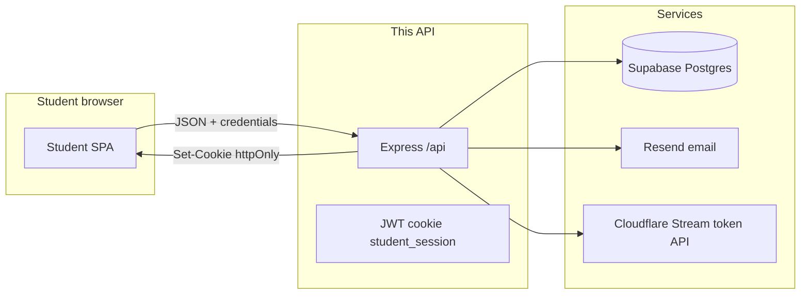

# MET Academy — Student Portal API

Student-only backend: **auth** (JWT in an httpOnly cookie), **activation**, **forgot/reset password**, **published modules**, and **Cloudflare Stream** signed playback tokens.

**Stack:** Node.js, Express.js, Supabase (Postgres), JWT, bcrypt, cookie-parser, CORS, dotenv, Resend, Axios, Swagger (OpenAPI 3).

---

## Student portal integration (end-to-end)

This section is the main guide for **frontend**, **DevOps**, and **content** teams wiring the student SPA to this API.

**Dedicated frontend integration doc (all endpoints, examples, cookies):** [`docs/FRONTEND_INTEGRATION.md`](docs/FRONTEND_INTEGRATION.md)

### Architecture



- **Auth state** lives in an **httpOnly** cookie (`student_session`). The SPA does not read the JWT; it only sends `credentials: 'include'` on API calls.
- **Secrets** (`JWT_STUDENT_SECRET`, `SUPABASE_SERVICE_ROLE_KEY`, `CF_STREAM_API_TOKEN`, `RESEND_API_KEY`) stay on the server only.

### 1) Base URL and port

- All JSON routes are under **`/api`** (e.g. `https://api.yourdomain.com/api/auth/login`).
- **`FRONTEND_URL`** in `.env` must be the **exact origin** of the student SPA (scheme + host + port), e.g. `https://learn.metacademy.com` or `http://localhost:3000`. CORS is **single-origin** with **`credentials: true`**.
- On **macOS**, avoid port **5000** (often used by AirPlay). Default in this repo favors **`PORT=5001`**; match your deploy URL.

### 2) CORS and cookies (critical)

The API sets:

| Setting | Value |
|--------|--------|
| Cookie name | `student_session` |
| httpOnly | `true` |
| sameSite | `lax` |
| secure | `true` when `NODE_ENV=production` |
| path | `/` |

**Browser rules:**

1. Every mutating or authenticated request from the SPA must use **`credentials: 'include'`** (Fetch) or **`withCredentials: true`** (Axios).
2. **`FRONTEND_URL`** must equal the SPA origin you load in the browser, or the browser will block CORS and cookies will not be sent.
3. **Cross-site** setups (API on `api.example.com`, app on `app.example.com`) need a **shared parent domain** and careful cookie `Domain` configuration. This codebase does **not** set `domain` on the cookie (browser default = host-only). For **localhost**, API and SPA on **different ports** are different origins: cookies set by `localhost:5001` are **not** sent to `localhost:3000`. Typical dev fixes:
   - **Proxy** the API through the dev server (e.g. Vite `server.proxy` to `/api` → backend), so the browser sees **one origin**, or  
   - Run SPA and API behind one host/port, or  
   - Use a **tunnel** / shared hostname in dev.

**Production:** Prefer one site (e.g. same site with reverse proxy `/api` → Node) or explicit cookie `Domain=.yourdomain.com` if you extend the server to set it.

### 3) Environment variables (integration checklist)

Copy `.env.example` → `.env` and fill:

| Variable | Who needs it | Notes |
|----------|----------------|-------|
| `PORT` | Deploy | Listen port for Node. |
| `NODE_ENV` | Deploy | Use `production` in prod (enables **secure** cookies). |
| `FRONTEND_URL` | SPA + API | **Must** match student app origin for CORS + cookies. |
| `JWT_STUDENT_SECRET` | API only | Long random string; rotating it logs everyone out. |
| `SUPABASE_URL` | API only | Project URL. |
| `SUPABASE_SERVICE_ROLE_KEY` | API only | **Never** in the browser; server-only DB access. |
| `RESEND_API_KEY` | API only | Email sending. |
| `RESEND_FROM_EMAIL` | API only | Verified sender in Resend. |
| `BASE_URL` | API + users | **Links inside emails** (activation + reset). Should be the **student app** base where routes like `/activate` and `/reset-password` live (often same as `FRONTEND_URL`). |
| `CF_ACCOUNT_ID` | API only | Cloudflare account id for Stream token endpoint. |
| `CF_STREAM_API_TOKEN` | API only | API token with Stream permissions. |

### 4) Standard JSON envelope

**Success** (HTTP 2xx):

```json
{
  "success": true,
  "data": {},
  "message": ""
}
```

**Error:**

```json
{
  "success": false,
  "message": "Human-readable message"
}
```

Validation errors are typically **400** with `message` containing a short validation hint.

### 5) Auth endpoints (what the SPA should call)

Base path: **`/api/auth`**.

| Method | Path | Body (JSON) | Behavior |
|--------|------|-------------|----------|
| POST | `/api/auth/register` | `{ "email", "full_name", "password", "confirm_password" }` | **201** — **pending** user (password hashed), activation token (72h), **Resend** email with **`/activate?token=...`**. **No cookie** until **`POST /api/auth/activate`**. **409** if email exists. **502** if email fails (rolled back). `Accept-Language`: `fr` / `en`. |
| POST | `/api/auth/login` | `{ "email", "password" }` | On success: sets **`student_session`**, returns `data` = `{ id, full_name, email }`. **401** wrong email/password. **403** if **pending** or **disabled** (distinct messages). Send **`Accept-Language: fr`** (or `en`) for FR/EN copy. |
| GET | `/api/auth/token-check` | Query: **`token`** (required), **`type`** = `activation` \| `reset` (default `activation`) | **Read-only.** Always **200** with `data.status`: `valid` \| `invalid` \| `used` \| `expired` — for `/activate` and `/reset-password` page load without submitting a password. |
| POST | `/api/auth/activate` | `{ "token", "password", "confirm_password" }` | From email link query `token`. Sets cookie; returns user profile in `data`. |
| POST | `/api/auth/forgot-password` | `{ "email" }` | **Always 200** + same success message (no email enumeration). |
| POST | `/api/auth/reset-password` | `{ "token", "password", "confirm_password" }` | From email link query `token`. Sets cookie; returns user in `data`. |
| POST | `/api/auth/logout` | _(none)_ | Clears cookie. |

**Frontend routes (your SPA, not this repo):**

- Activation link in email: **`${BASE_URL}/activate?token=...`**
- Reset link: **`${BASE_URL}/reset-password?token=...`**

Those pages should read `token` from the query string and POST to the API with `credentials: 'include'`.

**Password rules:** API expects **min 8 characters** for activate/reset (see validators in `src/routes/auth.routes.js`).

### 6) Protected module + video endpoints

Base path: **`/api/modules`**. Requires a valid session: **`student_session`** cookie **or** **`Authorization: Bearer`** with the **`access_token`** from login / activate / reset-password **or** header **`X-Access-Token`** with that same JWT. Prefer headers when the SPA and API are on different origins and cookies are not sent.

| Method | Path | Returns |
|--------|------|---------|
| GET | `/api/modules` | `data`: array of published modules: `id`, `order_index`, `title`, `description`, `duration_seconds`, `thumbnail_url` (nullable; no `video_id`). |
| GET | `/api/modules/:id/token` | `data`: `{ "token": "<Cloudflare signed token>" }` (~2h). |

**Playing video in the SPA:** The API never exposes `video_id` to the client. You still need a **playback URL** from your player docs. Cloudflare Stream signed playback typically uses the **signed token** together with your **account / customer subdomain** or **iframe** URL pattern. Follow [Cloudflare Stream — securing your stream](https://developers.cloudflare.com/stream/viewing-videos/securing-your-stream/) for the exact URL your player (HLS, iframe, React player) expects. The **`token`** from this API is the short-lived signed token from Cloudflare’s token endpoint.

### 7) Example Fetch helpers (browser)

```javascript
const API = import.meta.env.VITE_API_URL ?? 'http://localhost:5001';

async function api(path, options = {}) {
  const res = await fetch(`${API}${path}`, {
    ...options,
    headers: {
      'Content-Type': 'application/json',
      ...(options.headers || {}),
    },
    credentials: 'include',
  });
  const body = await res.json().catch(() => ({}));
  if (!res.ok) {
    const err = new Error(body.message || res.statusText);
    err.status = res.status;
    err.body = body;
    throw err;
  }
  return body;
}

export const login = (email, password) =>
  api('/api/auth/login', { method: 'POST', body: JSON.stringify({ email, password }) });

export const register = (email, full_name, password, confirm_password) =>
  api('/api/auth/register', {
    method: 'POST',
    body: JSON.stringify({ email, full_name, password, confirm_password }),
  });

export const logout = () => api('/api/auth/logout', { method: 'POST' });

export const activate = (token, password, confirm_password) =>
  api('/api/auth/activate', {
    method: 'POST',
    body: JSON.stringify({ token, password, confirm_password }),
  });

export const forgotPassword = (email) =>
  api('/api/auth/forgot-password', { method: 'POST', body: JSON.stringify({ email }) });

export const resetPassword = (token, password, confirm_password) =>
  api('/api/auth/reset-password', {
    method: 'POST',
    body: JSON.stringify({ token, password, confirm_password }),
  });

/** type: 'activation' | 'reset' — returns { success, data: { status } } */
export const checkAuthToken = (token, type = 'activation') =>
  api(`/api/auth/token-check?token=${encodeURIComponent(token)}&type=${encodeURIComponent(type)}`);

export const listModules = () => api('/api/modules');

export const getModulePlaybackToken = (moduleId) =>
  api(`/api/modules/${moduleId}/token`);
```

Adjust `API` to your deployed API origin (or use a dev proxy so `API` is `''` and paths are relative).

### 8) Supabase and provisioning

- **Schema + student RLS:**  
  - New project / full script: `supabase/schema_and_rls.sql`  
  - **Tables already exist:** `supabase/existing_tables_only.sql` (adds `activation_tokens.type`, indexes, student RLS).  
  - **RLS only (policies + grants):** `supabase/student_portal_rls.sql` — run if you already ran schema earlier and only need to apply/update student policies.
- **Student RLS rules:** `authenticated` may **SELECT** own `users` row (no `password_hash` column grant) and **SELECT** published `modules` rows (no `video_id` column grant). **No** access to `activation_tokens` or `admins` for anon/authenticated. Matches the student brief; **not** the admin portal.
- **Supabase Auth:** Policies use `auth.uid()` = `public.users.id`. When provisioning a student, create `auth.users` and `public.users` with the **same UUID** (or add the optional FK in the SQL comment at end of `schema_and_rls.sql`).
- **Service role:** This API uses **`SUPABASE_SERVICE_ROLE_KEY`** only on the server; it **bypasses RLS**. RLS applies when the SPA uses the **anon** or **authenticated** Supabase client.
- **Student lifecycle:** **`POST /api/auth/register`** creates a **pending** user, activation token, and sends **`${BASE_URL}/activate?token=...`** via Resend. The student finishes with **`POST /api/auth/activate`**. You can still provision users manually in Supabase if needed.

**`activation_tokens.type`:** Must support **`activation`** and **`reset`** (forgot-password flow inserts `reset`).

### 9) Swagger / OpenAPI

- **UI:** `GET /api/docs` (e.g. `http://localhost:5001/api/docs`)
- **JSON:** `GET /api/docs.json`

Use this for contract reference and QA. Cookie auth in “Try it out” only works when the browser context matches your CORS/cookie setup.

### 10) Security summary (for reviewers)

- Generic **401** for wrong password or unknown email (same message).
- **403** on login for **pending** or **disabled** accounts with **different** messages (`Accept-Language` selects FR/EN).
- bcrypt for passwords; responses never include **`password_hash`** or raw DB tokens.
- Activation/reset tokens: **single-use**, **72h** expiry, cryptographically random.

---

## Run the API locally

```bash
cp .env.example .env
# Fill all variables
npm install
npm run dev
```

- Root **`/`** redirects to **`/api/docs`**.
- See **macOS / port 5000** notes earlier in this file (AirPlay vs Node).

## Scripts

| Command | Purpose |
|---------|---------|
| `npm run dev` | Nodemon |
| `npm start` | `node src/server.js` |

## Project layout

```
src/
├── server.js
├── app.js
├── config/
│   ├── supabase.js
│   └── swagger.js
├── routes/
│   ├── auth.routes.js
│   └── module.routes.js
├── controllers/
│   ├── auth.controller.js
│   └── module.controller.js
├── middleware/
│   ├── studentAuth.js
│   ├── validate.js
│   ├── asyncHandler.js
│   └── errorHandler.js
├── utils/
│   ├── jwt.js
│   ├── i18n.js
│   ├── email.js
│   ├── provisionStudent.js
│   ├── token.js
│   ├── cloudflareStream.js
│   └── response.js
└── constants/
    └── messages.js

supabase/
├── schema_and_rls.sql           # full create + student RLS
├── existing_tables_only.sql     # brownfield: ALTER + student RLS
└── student_portal_rls.sql       # policies + grants only (re-apply RLS)

docs/
└── FRONTEND_INTEGRATION.md      # SPA: all APIs, cookies, examples
```

## Production checklist

- [ ] `NODE_ENV=production`
- [ ] Strong `JWT_STUDENT_SECRET`
- [ ] HTTPS for API and SPA (`secure` cookies)
- [ ] `FRONTEND_URL` = real student SPA origin
- [ ] `BASE_URL` = real links in emails (usually SPA URL)
- [ ] Resend domain verified; `RESEND_FROM_EMAIL` allowed
- [ ] Cloudflare token has least privilege for Stream only
- [ ] Supabase keys never committed; service role only on server
- [ ] CORS/cookie domain strategy validated on staging (login + modules + video token)

---

## Out of scope for this service

Admin portal app, payments, progress, certificates, and subscriptions are intentionally not implemented here. **Student self-registration** is available via **`POST /api/auth/register`**.
